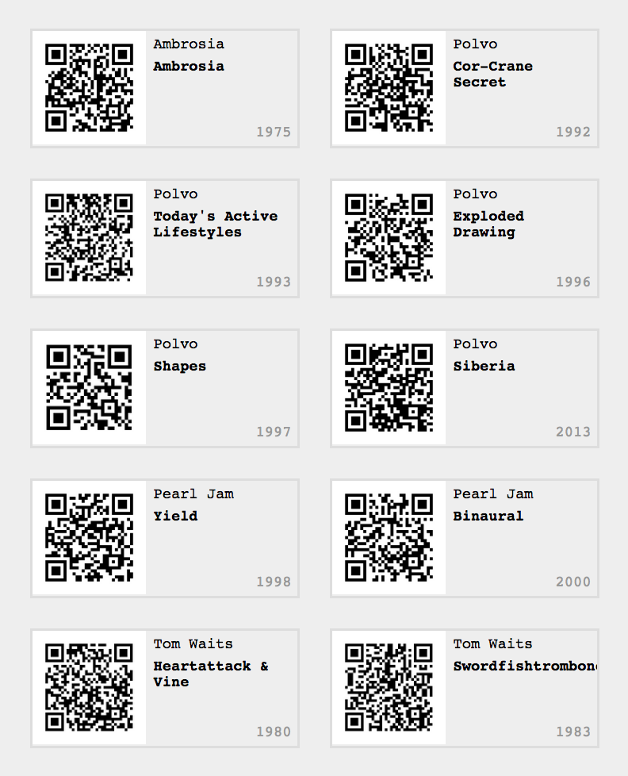

# qrgen

Generate printable sheet of QR codes with album titles.

## Prerequisites

* macOS or Linux
* node, npm, yarn
* ruby

## Installation

Run `yarn install`.

## Usage

Add to `qrcodes.csv`.

Run `$(npm run)/gulp build`.

Output is in `qrcode.html`. This file has integrated print stylesheet. So you can print this on A4 paper and cut it out with a scissors.

## License

MIT 

&copy; Thijs Smits
